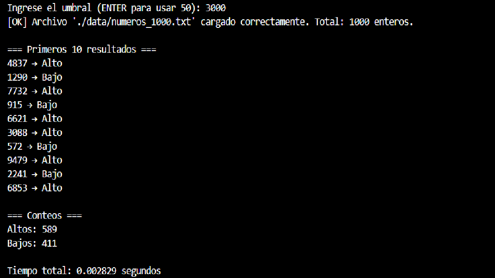

# **Universidad Da Vinci de Guatemala**  
## **Facultad de Ingeniería en Sistemas**  
### **Curso: Análisis de Algoritmos**  
### **Práctica: Árbol de Decisión (Umbral)**  

**Nombre:** Jorge Estuardo Rustrian del Pinal 
**Carnet:** 202404318  
**Fecha:** 17 de  Noviembre 2025  

---

# 📝 **Objetivo General**
Implementar un árbol de decisión simple de un solo nodo capaz de clasificar números enteros en dos categorías (“Alto” y “Bajo”) según un umbral definido, utilizando técnicas básicas de análisis de algoritmos, lectura de datos y buenas prácticas de control de versiones con Gitflow.

---

# 🎯 **Objetivos Específicos**
1. Desarrollar un módulo capaz de generar o cargar una lista de números enteros desde un archivo llamado numeros_1000.txt
2. Implementar un árbol de decisión con un único nodo de decisión usando un umbral configurable con valor por default de 50.
3. Clasificar correctamente los números en las categorías “Alto” y “Bajo”.
4. Medir el tiempo total de ejecución del proceso de clasificación.
5. Aplicar adecuadamente la metodología Gitflow en el control del proyecto.

---

# 🌳 **Descripción del Árbol de Decisión**
- El árbol tiene **un solo nodo de decisión**.
- Posee **dos hojas**:
  - Hoja 1 → “Alto”
  - Hoja 2 → “Bajo”
- El umbral tiene un valor por defecto de **50**

# 🔧 **Metodología**

## **1. Flujo del Script**
1. **Carga de datos**  
   - El módulo `data_loader.py` lee el archivo `numeros_1000.txt`.  
   - Si el archivo no existe, se crea vacío.
   - Retorna una lista de enteros válidos.

2. **Clasificación con el árbol de decisión**  
   - El módulo `decision_tree.py` recibe la lista de números.  
   - Aplica la regla:  
     - `n >= umbral` → “Alto”  
     - `n < umbral` → “Bajo”
   - Calcula los conteos totales.
   - Devuelve resultados y medición de tiempo.

3. **Ejecución del script principal** (`main.py`)  
   - Llama a `load_numbers()`.  
   - Llama a `clasificar_numeros()`.  
   - Imprime:
     - Los primeros 10 resultados en el formato:  
       `23 → Bajo`, `67 → Alto`, …
     - Conteos totales.
     - Tiempo total en segundos.

     ## Resultados – Capturas

### Ejecución del script
**Ejecuion con umbral = 50**

**Ejecuion con umbral = 3000**

